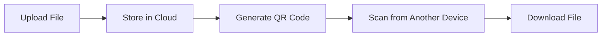

# 🚀 QR File Sharing Platform  
### ⚡ Scan • Share • Done

A cloud-based file sharing platform that enables seamless transfer of files using QR codes. This system allows users to upload files and instantly generate a QR code, which can be scanned by other devices to download the file securely and efficiently.

---
## 🌐 Live Demo  
🔗 https://qr-file-sharing-sable.vercel.app

---

## 🎯 Project Overview  

A **next-gen file sharing platform** that eliminates the need for cables, logins, or complicated transfers.  

Just upload → scan QR → download instantly across devices.

---

## ✨ Key Features

- 🚀 Instant file upload  
- 🔗 Unique QR code for every file  
- 📲 Cross-device access (mobile + desktop)  
- ☁️ Cloud-based storage  
- ⚡ Lightning-fast transfers  
- 🧹 Auto file expiration  
- 🔒 Secure access system  

---

## 🧠 How It Works



---

## 🛠️ Tech Stack

### 🎨 Frontend  
- HTML5  
- CSS3  
- JavaScript / React  

### ⚙️ Backend  
- Node.js  
- Express.js  

### 🗄️ Database  
- MongoDB / Firebase / PostgreSQL  

### 🔧 Tools  
- QR Code Generator  
- AWS S3 / Firebase Storage  

---

## 📂 Project Structure

```
QR-file-sharing/
│
├── client/            # Frontend UI
├── server/            # Backend logic
├── public/            # Static assets
├── uploads/           # Temporary storage
├── .env               # Environment config
├── package.json
└── README.md
```

---

## ⚙️ Installation

```bash
# Clone repository
git clone https://github.com/your-username/your-repo-name.git

# Navigate
cd your-repo-name

# Install dependencies
npm install

# Run project
npm start
```

---

## 🔐 Environment Variables

Create a `.env` file:

```env
PORT=5000
DATABASE_URL=your_database_url
CLOUD_API_KEY=your_key
```

---

## 🚀 Usage

1. Upload a file 📤  
2. Get QR code 🔳  
3. Scan from another device 📱  
4. Download instantly 📥  

---

## 🔐 Security Features

- ✔️ File validation  
- ✔️ Temporary access links  
- ✔️ Cloud-secured storage  
- ✔️ Optional auto-expiry  

---

## 🧪 Future Improvements

- 🔐 User authentication  
- 🧬 End-to-end encryption  
- 🖱️ Drag & drop UI  
- 📦 Multi-file sharing  
- 📊 Analytics dashboard  

---

## 🏆 Why This Project Stands Out

- ✔️ Real-world use case  
- ✔️ Clean architecture  
- ✔️ Scalable cloud integration  
- ✔️ Cross-device compatibility  
- ✔️ Simple yet powerful UX  

---

## 🤝 Contributing

```bash
# Fork the repo
# Create a branch
git checkout -b feature/your-feature

# Commit changes
git commit -m "Added new feature"

# Push
git push origin feature/your-feature
```

Then open a Pull Request 🚀

---
